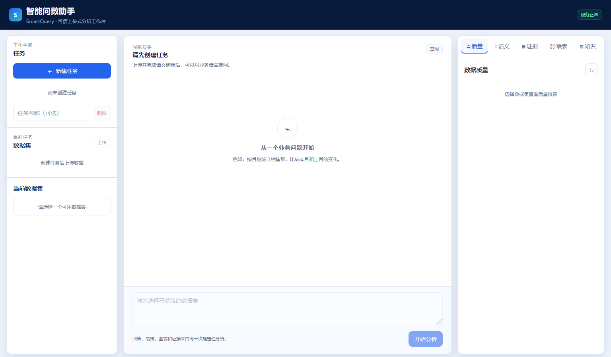
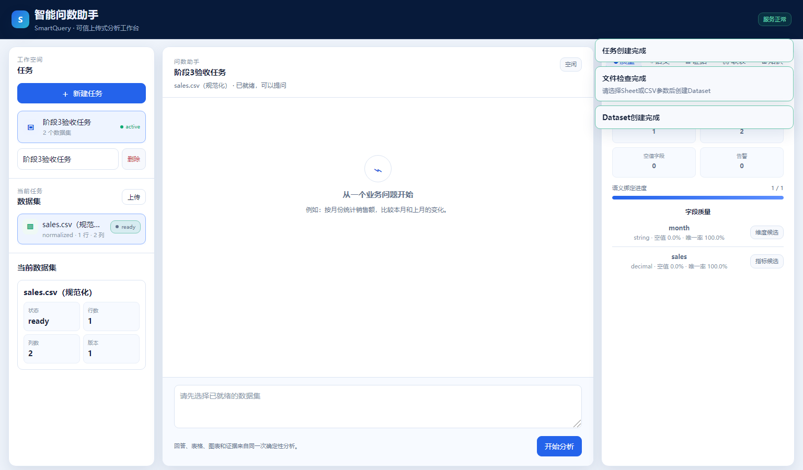
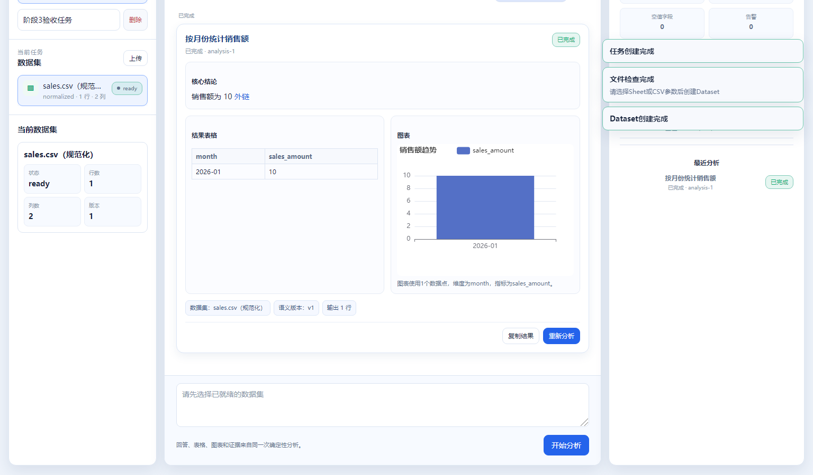
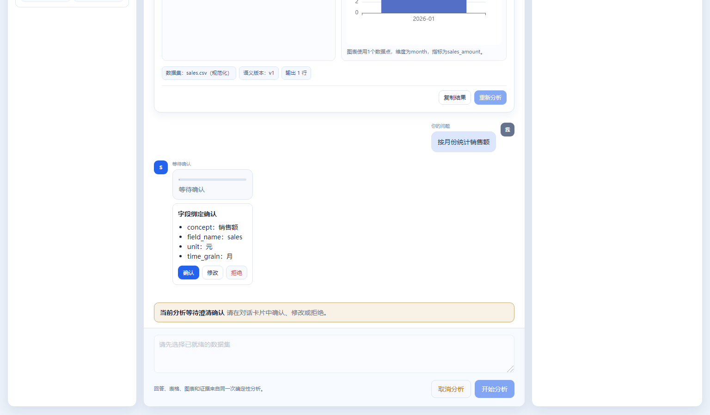
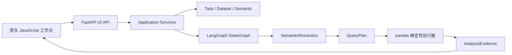

# SmartQuery（ExcelMind v2）

可信上传式智能问数与分析工作台。

SmartQuery lets users upload XLSX or CSV files, ask business questions in natural language, and receive deterministic, evidence-backed answers, tables, and safe charts. ExcelMind is the historical project name.


> 当前版本是面向演示和开发验证的 Alpha 版本，不建议直接用于生产环境或处理敏感数据。

## 页面截图

### 创建任务



### Dataset 就绪



### 分析完成



### 等待业务澄清



## 解决的问题

传统自然语言问数容易出现字段映射不稳定、指标口径临时编造、计算过程不可复核等问题。SmartQuery 在模型与数据执行之间增加轻量指标语义层和结构化 QueryPlan：

- 将业务术语映射到当前上传 Dataset 的物理字段。
- 在字段、单位或粒度存在歧义时要求用户确认。
- 限制模型只生成结构化语义解析，不直接执行 SQL 或任意 Python。
- 使用 pandas 确定性执行并生成 AnalysisEvidence。
- 让回答、表格和图表使用同一份分析证据。

## 用户流程

```text
上传 XLSX/CSV
→ 创建 Dataset
→ 查看数据质量
→ 确认语义绑定
→ 输入业务问题
→ 生成并校验 QueryPlan
→ pandas 确定性执行
→ 返回 Answer、表格、图表和 AnalysisEvidence
```

## 当前能力

- 任务级数据隔离，最多保留 5 个临时任务。
- XLSX、CSV、多 Sheet 上传检查、预览、Profile 和规范化确认。
- 全局版本化语义模型与任务级字段绑定。
- 筛选、明细、聚合、分组、排名、趋势、跨期比较、占比和比率。
- 受限指标公式 AST，禁止 `eval`、`exec`、导入、文件和网络访问。
- 安全联表建议、匹配率、基数和重复膨胀检查。
- 任务级 Markdown 知识文档与临时检索。
- SSE 流式问数、业务澄清、取消和断流后的状态查询。
- 基于 Evidence 的安全 ECharts 图表与 Markdown 结果展示。
- 本地 ECharts、Marked 和系统字体，无公网时仍可加载工作台资源。

## 技术架构



QueryPlan 不是 SQL，也不是指标语义层本身。语义层负责定义业务概念及其字段绑定；QueryPlan 是一次分析的结构化执行计划；当前执行器将计划编译为受控的 pandas 操作。

## 快速启动

### 环境要求

- Python 3.11
- [uv](https://docs.astral.sh/uv/)

### 1. 下载与安装依赖

```bash
git clone https://github.com/silasxlx/SmartQuery.git
cd SmartQuery
uv sync --dev
```

### 2. 创建本地配置

Windows PowerShell：

```powershell
Copy-Item config.example.yaml config.yaml
```

Linux/macOS：

```bash
cp config.example.yaml config.yaml
```

### 3. 配置模型服务

`config.example.yaml` 提供 OpenAI 兼容模型和 Embedding 服务示例。请按选用的 Provider 设置对应环境变量，例如：

```text
SELF_HOSTED_API_KEY
SELF_HOSTED_BASE_URL
SELF_HOSTED_EMBEDDING_URL
```

也可以在本地 `config.yaml` 中切换已声明的 Provider。不要把 API Key、Token 或真实服务凭证写入 Git 跟踪文件。

Provider 必须支持原生结构化输出或 Tool Calling；缺少模型密钥时，确定性测试仍可使用 Mock Provider 运行，但自然语言问数不能调用真实模型。

### 4. 启动服务

```bash
uv run python -m excel_agent.main serve
```

浏览器打开 <http://localhost:8000>，OpenAPI 文档位于 <http://localhost:8000/docs>。

## 默认运行边界

- 单文件最大 10 MB。
- 单 Dataset 最大 5 万行、200 列、10 个 Sheet。
- 最多 5 个临时任务，每个任务最多保留 20 条分析记录。
- 上传文件、DataFrame、任务知识索引和分析记录均为临时资源。
- 服务重启后任务、Dataset 和分析记录失效。
- 默认 CORS 只允许本机来源。

## `/api/v2` 接口概览

| 能力 | 主要接口 |
| --- | --- |
| 健康检查 | `GET /api/v2/health` |
| 任务 | `POST/GET /api/v2/tasks`、`GET/DELETE /api/v2/tasks/{task_id}` |
| 上传与 Dataset | `POST /api/v2/tasks/{task_id}/uploads`、`POST/GET /api/v2/tasks/{task_id}/datasets` |
| 质量与预览 | `GET .../{dataset_id}/profile`、`GET .../{dataset_id}/preview` |
| 语义模型与绑定 | `GET /api/v2/semantic-model`、`GET .../semantic-bindings` |
| 问数 | `POST .../chat`、`POST .../chat/stream` |
| 分析 | `GET .../analyses/{analysis_id}`、`POST .../cancel`、`DELETE .../analyses/{analysis_id}` |
| 联表 | `POST .../join-suggestions`、`POST .../joins` |
| 任务知识 | `POST/GET/DELETE .../knowledge/documents` |

旧版接口仅保留为兼容入口，不建议新功能继续使用。

## 测试与质量

```bash
uv run pytest -q
uv run pytest --cov=src/excel_agent --cov-report=term-missing
uv run ruff check .
uv run python scripts/scan_secrets.py
uv build
```

测试资产覆盖单元测试、API 集成、安全检查、30 个黄金问数案例和 Python Playwright 工作台流程。当前发布基线为 111 项测试通过、代码覆盖率 86%；不同平台可能因浏览器组件不可用而跳过部分 Playwright 测试。

## 公开目录

```text
SmartQuery/
├── src/excel_agent/       应用、领域、执行器、Agent 与前端
├── semantic_model/        示例业务语义模型
├── tests/                 单元、集成、安全、黄金案例与端到端测试
├── scripts/               秘密扫描等发布检查脚本
├── docs/screenshots/      README 页面截图
├── config.example.yaml    脱敏配置模板
├── pyproject.toml         项目元数据与依赖
└── uv.lock                可复现依赖锁文件
```

## 安全与数据边界

- 只使用模拟或脱敏数据，不上传真实银行、客户或生产数据。
- 不要提交 `.env`、`config.yaml`、API Key、Token、日志或临时文件。
- 模型只能接收受限 Schema、语义定义、代表值、相关任务知识和本地执行结果。
- 页面不展示模型原始思维链、完整 Prompt、绝对服务器路径或敏感调试信息。
- 图表只接受服务端白名单 ChartSpec，不执行任意 JavaScript、formatter 或外部 URL。
- 当前版本没有登录、权限、多用户协作、生产级持久化或 SLA。

## 当前限制

本 Alpha 版本暂不包含：

- 数据库连接、SQL 执行和 DuckDB。
- 预测、复杂统计和任意 Python/代码解释器。
- Excel、PDF、Word 或图片导出。
- OCR、图片理解和其他重型多模态能力。
- 全局语义模型在线编辑和生产级任务持久化。

## 许可证

本项目采用 [MIT License](./LICENSE)，版权所有归 `SmartQuery contributors`。

## English summary

SmartQuery (ExcelMind v2) is a local, upload-based natural-language analytics workbench for XLSX and CSV data. It resolves business questions through a lightweight semantic layer, validates a structured QueryPlan, executes it deterministically with pandas, and returns evidence-backed answers, tables, and safe charts. This alpha is intended for demos and development; it does not connect to production databases or expose arbitrary SQL/Python execution.
